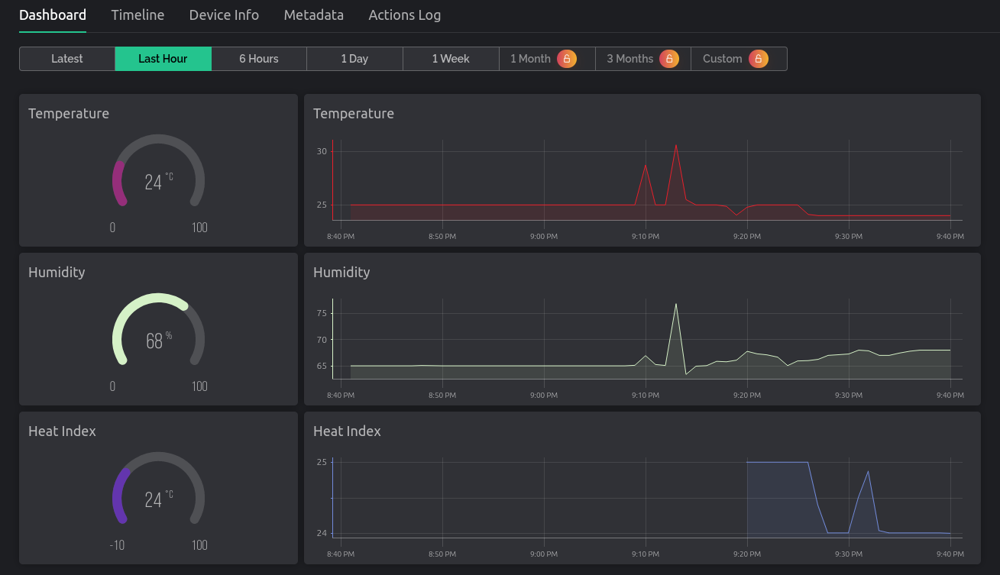
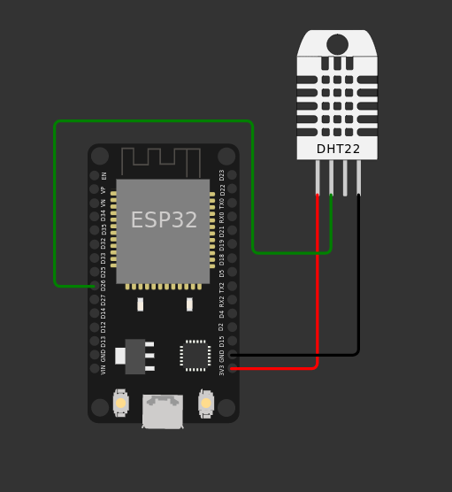

# esp32-temperature-monitor
Temperature, humidity and heat index monitor using the Arduino framework on PlatformIO for the ESP32 DevKit V1 board. Also using the Blynk IoT platform to monitor the data.

## Dashboard

## Circuit Diagram
**A DHT22 is used in the image instead of a DHT11 because WokWi didn't have a DHT11.** 

